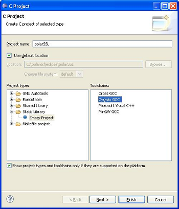
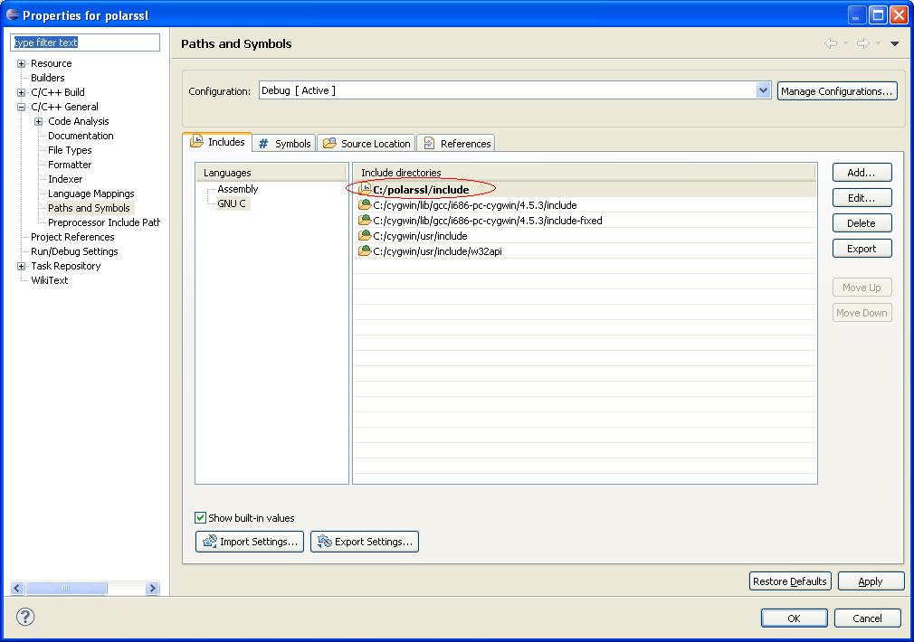
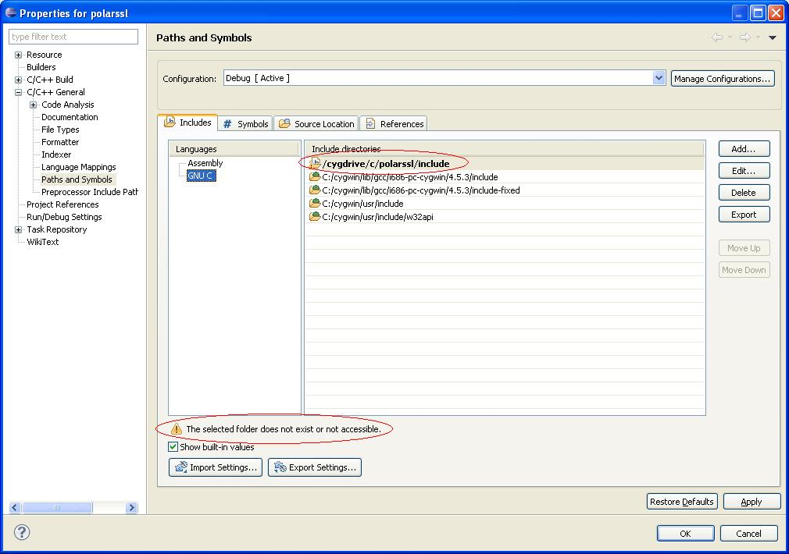

# Compile Mbed TLS to a static library in Eclipse CDT

## Introduction
This tutorial will show how to compile Mbed TLS to a static `.a ` library file in Eclipse CDT.

## Requirements

* Ensure Cygwin and Eclipse CDT are properly installed on your Windows system.

 * If not, check our manual [How to set up the Eclipse CDT environment on Windows](setup-eclipse-cdt-environment-on-windows.md) to get you started.

## Download Mbed TLS
* Download the [latest version of Mbed TLS](/download).
* Unpack the downloaded file to a location of your choice, such as `C:/MbedTLS`.

**Note:** Avoid locations like `Documents and Settings` or `Program Files (x86)` because spaces and special characters in the path can cause problems in Eclipse.

## Create the project

* Start your Eclipse CDT environment by running `eclipse.exe` in the Eclipse installed directory.
* Choose an appropriate directory for the workspace you would like to save your project.
* You can close the **Welcome** screen if it pops up.
* Create your new C project by choosing  **File** > **New C Project**.
* The **C Project** dialog pops up:

* In the **Project name** field, enter your project name (for example, "Mbedtls").

**Note:** Be aware that the compiler will automatically prefix your compiled static library name with `lib` in front of the project name. A project named ``Mbedtls`` will produce a `libmbedtls.a` library.

* Leave **Use default location** checked.
* In the **Project Types** box, select **Static Library** > **Empty Project**.
*  In the **Toolchains** box, choose your compiler (such as **Cygwin GCC** or **MinGW GCC**) and click **Next**.
* The **Select Configurations** dialog appears.
* Select both **Debug** and **Release**, then click **Finish**.
* Your C project is now created.

## Import Mbed TLS code into your project

In this step, you import the Mbed TLS code into the project and make it ready for compilation.

* Inside the **Project Explorer tree** on the left side, right click on your **project folder** and click **Properties**.
* A **project properties window** pops up.
* Go to **C/C++** > **General Paths and Symbols** and choose the **includes** tab.
* Under **Languages**, select **GNU C**.
* Add the Mbed `include` location and click **Apply**, then **OK**.

Since we are using a mixture of Windows- and Unix-based tools, we will encounter our first problem:

**Option 1:** Windows-style path:

If you add a Windows-style path like `C:/mbed/include`, project rebuilds will fail and `make` returns a `multiple target` error caused by the ``:`` character in your path.
One solution is to always clean the project before a new rebuild.

**Option 2:** Cygwin-style path:

If you add a Cygwin-style path like `/cygdrive/c/mbed/include` Eclipse will warn you that the directory cannot be found, and all your includes get an unresolved warning.
**The project will compile anyway.**

* Right click on your project and click **Import**.
* Choose **General** > **Filesystem** and  **Next**.

* Navigate to the **MbedTLS** library folder
* Select all the `.c` files
* Click **Finish**.

## Build your project

Your project is now ready to build.

* Right click on your project folder.
* Click **Build project**.
* Your compiled ``lib .a`` file is located inside the **Debug** folder.

<!--- compile-mbedtls-to-a-static-library-in-eclipse-cdt
,"How to compile Mbed TLS into a static .a library under the Eclipse CDT environment under Windows","compiling Mbedssl in Eclipse, Mbedssl windows","compile, eclipse, windows, tutorial",published,"2013-01-07 10:27:00",6,7589,"2015-07-24 11:39:00","Paul Bakker" --->
